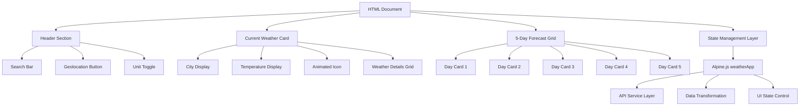
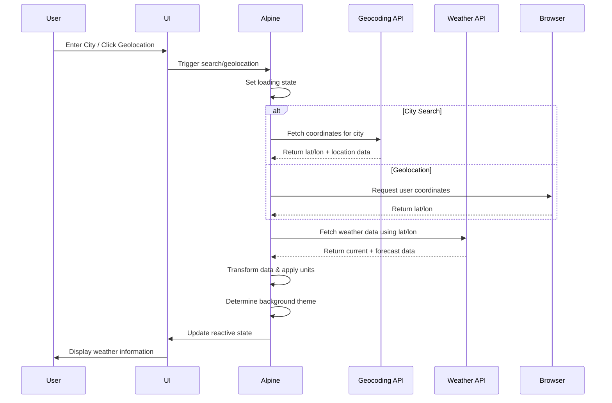
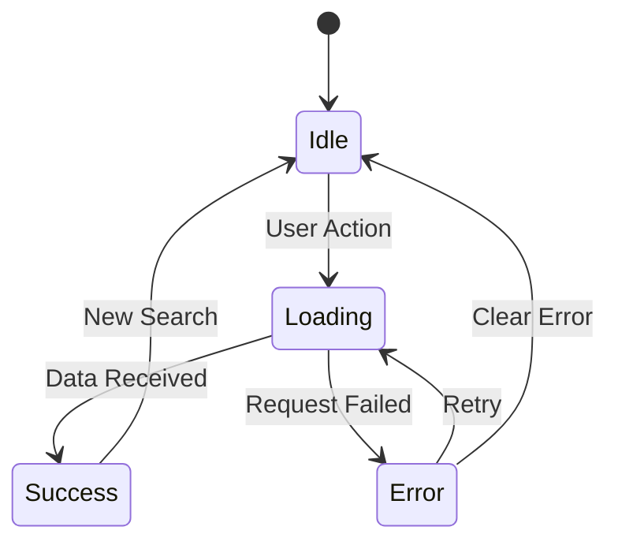
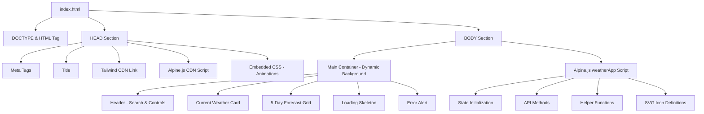

# Weather Forecast Dashboard - Design Document

## 1. Overview

### 1.1 Purpose

A lightweight, single-file weather forecast dashboard that displays current weather conditions and a 5-day forecast using real-time data from Open-Meteo API. The application emphasizes simplicity, immediate execution (no API key required), and visual appeal through dynamic backgrounds and animated weather icons.

### 1.2 Scope

This design covers a fully self-contained HTML application utilizing Tailwind CSS for styling and Alpine.js for reactive state management. The application will run entirely in the browser without requiring build tools, dependencies, or backend services.

### 1.3 Key Constraints

- Single HTML file implementation
- No framework bundlers (React/Vue/Svelte)
- Alpine.js for reactivity and state management
- Tailwind CSS via CDN for styling
- Open-Meteo API (no authentication required)
- Client-side unit conversion (no API re-fetching)

---

## 2. Architecture

### 2.1 Component Structure



### 2.2 Data Flow



---

## 3. Visual Design Specification

### 3.1 Theme System

**Aesthetic Approach**: Modern "Aero" design with glass-morphism effects, subtle shadows, and smooth gradients.

### 3.2 Dynamic Background Mapping

The application background adapts based on current weather conditions:

| Weather Condition | WMO Code Range | Background Gradient    | Description                              |
| ----------------- | -------------- | ---------------------- | ---------------------------------------- |
| Clear (Day)       | 0              | Blue to Orange         | Bright sky transitioning to sunset tones |
| Clear (Night)     | 0 (nighttime)  | Indigo to Purple       | Deep night sky gradient                  |
| Partly Cloudy     | 1-3            | Sky Blue to Light Gray | Soft cloudy atmosphere                   |
| Overcast          | 45-48          | Gray to Slate          | Heavy cloud cover                        |
| Rain              | 51-67, 80-82   | Slate to Blue-Gray     | Rainy day ambiance                       |
| Snow              | 71-77, 85-86   | Ice Blue to White      | Winter/snowy conditions                  |
| Thunderstorm      | 95-99          | Dark Gray to Charcoal  | Stormy dramatic sky                      |

### 3.3 Typography

| Element             | Font Family       | Size     | Weight |
| ------------------- | ----------------- | -------- | ------ |
| City Name           | Inter / system-ui | 2rem     | 700    |
| Current Temperature | Inter / system-ui | 4rem     | 800    |
| Section Headers     | Inter / system-ui | 1.5rem   | 600    |
| Body Text           | Inter / system-ui | 1rem     | 400    |
| Weather Details     | Inter / system-ui | 0.875rem | 500    |

### 3.4 Animation Specifications

#### 3.4.1 SVG Weather Icons

Icons are inline SVG elements with specific CSS animations:

| Icon Type | Animation Name | Behavior                    | Duration | Timing                           |
| --------- | -------------- | --------------------------- | -------- | -------------------------------- |
| Sun       | spin           | Continuous rotation         | 20s      | linear, infinite                 |
| Cloud     | float          | Horizontal drift left-right | 6s       | ease-in-out, infinite, alternate |
| Rain      | fall           | Vertical drop motion        | 1s       | linear, infinite                 |
| Snow      | fall (slower)  | Gentle downward drift       | 3s       | ease-in, infinite                |

#### 3.4.2 Content Transitions

| Element          | Transition Type    | Duration  | Trigger            |
| ---------------- | ------------------ | --------- | ------------------ |
| Weather Card     | Fade-in + Slide-up | 0.5s      | Data load complete |
| Forecast Cards   | Staggered fade-in  | 0.3s each | Data load complete |
| Error Message    | Fade-in            | 0.3s      | Error state        |
| Loading Skeleton | Pulse opacity      | 1.5s loop | Loading state      |

---

## 4. Functional Requirements

### 4.1 Header Controls

#### 4.1.1 City Search

- **Input Field**: Text input for city name
- **Search Button**: Triggers geocoding lookup
- **Behavior**:
  - On click or Enter key, initiate API flow
  - Trim whitespace from input
  - Display error if input is empty

#### 4.1.2 Geolocation Button

- **Icon**: Location pin or target SVG
- **Behavior**:
  - Request browser geolocation permission
  - Handle permission denial gracefully
  - Use returned coordinates directly for weather fetch
  - Display loading state during coordinate acquisition

#### 4.1.3 Unit Toggle

- **States**: Celsius (Metric) / Fahrenheit (Imperial)
- **Visual**: Toggle switch or button group
- **Behavior**:
  - Toggle between 'metric' and 'imperial' state
  - Trigger immediate re-calculation of displayed temperatures
  - Persist preference in component state
  - No API re-fetch required

### 4.2 Current Weather Card

#### 4.2.1 Primary Display Elements

| Element             | Data Source                                 | Format           | Example               |
| ------------------- | ------------------------------------------- | ---------------- | --------------------- |
| City Name           | Geocoding API or Geolocation reverse lookup | String           | "New York"            |
| Country Code        | Geocoding API                               | ISO 3166 Alpha-2 | "US"                  |
| Current Temperature | `current.temperature_2m`                    | Number with unit | "24°C"                |
| Condition Text      | WMO code mapping                            | String           | "Partly Cloudy"       |
| Animated Icon       | WMO code mapping                            | SVG component    | (Sun/Cloud/Rain icon) |

#### 4.2.2 Weather Details Grid

A grid layout displaying supplementary metrics:

| Metric     | API Field                      | Display Format         |
| ---------- | ------------------------------ | ---------------------- |
| Humidity   | `current.relative_humidity_2m` | "65%"                  |
| Wind Speed | `current.wind_speed_10m`       | "12 km/h" or "7.5 mph" |
| Feels Like | Calculated or derived          | "22°C" or "72°F"       |

### 4.3 5-Day Forecast Section

#### 4.3.1 Forecast Card Structure

Each of 5 cards displays:

| Element         | Data Source                       | Transformation                |
| --------------- | --------------------------------- | ----------------------------- |
| Day Name        | `daily.time[index]`               | ISO date → "Mon", "Tue", etc. |
| Weather Icon    | `daily.weather_code[index]`       | WMO code → SVG component      |
| Max Temperature | `daily.temperature_2m_max[index]` | Number with unit conversion   |
| Min Temperature | `daily.temperature_2m_min[index]` | Number with unit conversion   |

#### 4.3.2 Layout

- Horizontal flex row or grid
- Responsive: stack vertically on mobile
- Equal spacing between cards

### 4.4 State Management

#### 4.4.1 Loading State

- **Trigger**: API request initiated
- **Display**:
  - Pulsing skeleton loaders in place of weather data
  - Disable search/geolocation buttons
  - Show loading spinner or animated indicator
- **Exit**: Data received or error occurred

#### 4.4.2 Error State

- **Triggers**:
  - Geocoding returns 0 results
  - Network failure
  - API timeout
  - Geolocation permission denied
- **Display**:
  - Red/rose colored alert box
  - User-friendly message: "Location not found, please try again"
  - Suggestion text for common issues
- **Recovery**: Clear error on new search attempt

#### 4.4.3 Success State

- Display current weather card
- Display 5-day forecast
- Apply dynamic background
- Clear any previous errors

---

## 5. Technical Implementation Strategy

### 5.1 Alpine.js State Object

The core reactive state is managed by an Alpine.js component named `weatherApp()`.

#### 5.1.1 State Properties

| Property       | Type          | Initial Value                                 | Purpose                           |
| -------------- | ------------- | --------------------------------------------- | --------------------------------- |
| searchQuery    | String        | ""                                            | Stores user input for city search |
| currentWeather | Object / null | null                                          | Current weather data              |
| forecast       | Array         | []                                            | Array of 5 daily forecast objects |
| loading        | Boolean       | false                                         | Loading indicator state           |
| error          | String / null | null                                          | Error message text                |
| units          | String        | "metric"                                      | Temperature unit system           |
| bgClass        | String        | "bg-gradient-to-br from-blue-400 to-blue-600" | Dynamic background CSS class      |
| locationName   | String        | ""                                            | Display name for current location |

#### 5.1.2 Key Methods

| Method Name          | Parameters             | Purpose                               |
| -------------------- | ---------------------- | ------------------------------------- |
| searchCity           | -                      | Initiates city search flow            |
| getCurrentLocation   | -                      | Triggers geolocation API              |
| fetchWeatherByCoords | lat, lon, locationName | Core weather fetch logic              |
| convertUnits         | -                      | Recalculates temperatures for display |
| mapWeatherCode       | code                   | Maps WMO code to icon/text            |
| formatDay            | dateString             | Converts ISO date to day name         |
| updateBackground     | weatherCode            | Sets bgClass based on conditions      |
| clearError           | -                      | Resets error state                    |

### 5.2 API Integration

#### 5.2.1 Geocoding Flow

**Endpoint**: `https://geocoding-api.open-meteo.com/v1/search`

**Request Parameters**:
| Parameter | Value | Purpose |
|-----------|-------|---------|
| name | User input city name | Search term |
| count | 1 | Limit to top result |
| language | en | Response language |
| format | json | Response format |

**Response Handling**:

- Extract `results[0].latitude`, `results[0].longitude`, `results[0].name`, `results[0].country_code`
- If `results` is empty or undefined, trigger error state
- Pass coordinates to weather fetch

#### 5.2.2 Weather Data Flow

**Endpoint**: `https://api.open-meteo.com/v1/forecast`

**Request Parameters**:
| Parameter | Value | Purpose |
|-----------|-------|---------|
| latitude | From geocoding or geolocation | Location coordinate |
| longitude | From geocoding or geolocation | Location coordinate |
| current | temperature_2m,relative_humidity_2m,weather_code,wind_speed_10m | Current weather variables |
| daily | weather_code,temperature_2m_max,temperature_2m_min,time | Daily forecast variables |
| timezone | auto | Automatic timezone detection |
| temperature_unit | celsius (always) | API temperature unit |
| wind_speed_unit | kmh (always) | API wind speed unit |

**Response Structure**:

```
{
  current: {
    temperature_2m: Number,
    relative_humidity_2m: Number,
    weather_code: Number,
    wind_speed_10m: Number
  },
  daily: {
    time: [ISO Date Strings],
    weather_code: [Number Array],
    temperature_2m_max: [Number Array],
    temperature_2m_min: [Number Array]
  }
}
```

**Processing**:

- Store `current` object in `currentWeather` state
- Extract first 5 items from `daily` arrays and construct forecast array
- Apply unit conversion if needed
- Update background based on `current.weather_code`

### 5.3 WMO Weather Code Mapping

The Open-Meteo API uses WMO (World Meteorological Organization) weather codes.

#### 5.3.1 Code to Condition Mapping

| WMO Code(s) | Condition Name   | Icon Component              | Background Theme |
| ----------- | ---------------- | --------------------------- | ---------------- |
| 0           | Clear Sky        | Sun (animated spin)         | Clear Day/Night  |
| 1           | Mainly Clear     | Sun with small cloud        | Partly Cloudy    |
| 2           | Partly Cloudy    | Cloud with sun peek         | Partly Cloudy    |
| 3           | Overcast         | Multiple clouds (float)     | Overcast         |
| 45, 48      | Fog              | Cloud with horizontal lines | Overcast         |
| 51, 53, 55  | Drizzle          | Light rain drops (fall)     | Rain             |
| 56, 57      | Freezing Drizzle | Ice rain drops              | Rain             |
| 61, 63, 65  | Rain             | Heavy rain drops (fall)     | Rain             |
| 66, 67      | Freezing Rain    | Ice rain drops              | Rain             |
| 71, 73, 75  | Snow             | Snowflakes (slow fall)      | Snow             |
| 77          | Snow Grains      | Small snowflakes            | Snow             |
| 80, 81, 82  | Rain Showers     | Rain with cloud             | Rain             |
| 85, 86      | Snow Showers     | Snow with cloud             | Snow             |
| 95, 96, 99  | Thunderstorm     | Cloud with lightning bolt   | Thunderstorm     |

#### 5.3.2 Helper Function Logic

The `mapWeatherCode(code)` function returns an object:

```
{
  text: "Condition name",
  icon: "iconIdentifier",
  backgroundTheme: "themeKey"
}
```

This enables both icon selection and background theme determination from a single function call.

### 5.4 Unit Conversion Strategy

**Principle**: Fetch data once in metric, convert client-side when units toggle.

#### 5.4.1 Temperature Conversion

| From       | To         | Formula        |
| ---------- | ---------- | -------------- |
| Celsius    | Fahrenheit | (C × 9/5) + 32 |
| Fahrenheit | Celsius    | (F - 32) × 5/9 |

#### 5.4.2 Wind Speed Conversion

| From | To   | Formula         |
| ---- | ---- | --------------- |
| km/h | mph  | km/h × 0.621371 |
| mph  | km/h | mph × 1.60934   |

**Implementation Approach**:

- Store raw API response in metric
- When rendering temperatures or wind speed, apply conversion function if `units === 'imperial'`
- Toggle button triggers state change, causing reactive re-render with converted values
- Display unit suffix dynamically: "°C" / "°F", "km/h" / "mph"

### 5.5 Date Formatting

**Input**: ISO 8601 date string (e.g., "2025-01-15")

**Output**: Short day name (e.g., "Wed")

**Approach**:

- Parse ISO string to JavaScript Date object
- Use `toLocaleDateString()` with options `{ weekday: 'short' }`
- Return abbreviated day name

**Edge Case Handling**:

- Today's forecast should display "Today" instead of day name
- Ensure timezone consistency with API's auto-detected timezone

---

## 6. SVG Icon System

### 6.1 Icon Requirements

All weather icons are inline SVG elements embedded directly in the HTML, not external images.

### 6.2 Icon Specifications

| Icon Name | Visual Elements                  | Animation                      | Viewbox     | Key Shapes                         |
| --------- | -------------------------------- | ------------------------------ | ----------- | ---------------------------------- |
| Sun       | Circular center + radiating rays | Rotate 360° continuously       | 0 0 100 100 | Circle + lines/polygons for rays   |
| Cloud     | Fluffy cloud shape               | Horizontal drift (translate X) | 0 0 100 100 | Overlapping circles/ellipses       |
| Rain      | Cloud + falling droplets         | Droplets fall vertically       | 0 0 100 100 | Cloud shape + small raindrop paths |
| Snow      | Cloud + snowflake symbols        | Snowflakes drift down slowly   | 0 0 100 100 | Cloud + asterisk/star shapes       |
| Lightning | Cloud + zigzag bolt              | Optional flicker effect        | 0 0 100 100 | Cloud + polygon bolt shape         |

### 6.3 Animation Keyframes

#### Sun Rotation

```
Animation: spin
From: rotate(0deg)
To: rotate(360deg)
Duration: 20s
Timing: linear, infinite
```

#### Cloud Float

```
Animation: float
From: translateX(-10px)
To: translateX(10px)
Duration: 6s
Timing: ease-in-out, infinite, alternate
```

#### Rain Fall

```
Animation: fall
From: translateY(-20px), opacity(0)
To: translateY(20px), opacity(1)
Duration: 1s
Timing: linear, infinite
```

#### Snow Drift

```
Animation: fall (slow variant)
From: translateY(-15px), opacity(0)
To: translateY(25px), opacity(1)
Duration: 3s
Timing: ease-in, infinite
```

### 6.4 Icon Selection Logic

Based on the `mapWeatherCode()` function output, the appropriate SVG is rendered conditionally using Alpine.js directives (x-show or x-if).

---

## 7. Responsive Design Strategy

### 7.1 Breakpoints

| Breakpoint | Screen Width   | Layout Adjustments                                         |
| ---------- | -------------- | ---------------------------------------------------------- |
| Mobile     | < 640px        | Stack forecast cards vertically, full-width search         |
| Tablet     | 640px - 1024px | 2-column forecast grid, larger current weather card        |
| Desktop    | > 1024px       | Horizontal 5-card forecast row, hero-style current weather |

### 7.2 Component Responsiveness

| Component             | Mobile                      | Tablet                          | Desktop                |
| --------------------- | --------------------------- | ------------------------------- | ---------------------- |
| Header Controls       | Stacked vertically          | Single row flex                 | Single row flex        |
| Current Weather Card  | Full width, reduced padding | Center-aligned, max-width 600px | Max-width 800px        |
| Forecast Grid         | Single column               | 2-3 columns                     | 5 columns (horizontal) |
| Temperature Font Size | 3rem                        | 4rem                            | 5rem                   |

---

## 8. Error Handling & Edge Cases

### 8.1 Error Scenarios

| Scenario            | Detection Method                  | User Feedback                                     | Recovery Action                |
| ------------------- | --------------------------------- | ------------------------------------------------- | ------------------------------ |
| Empty search input  | Check `searchQuery.trim().length` | Alert or inline message                           | Prompt user to enter city name |
| City not found      | Geocoding API returns 0 results   | "Location not found, please try again"            | Allow new search               |
| Network failure     | Fetch promise rejection           | "Unable to connect. Check your internet."         | Retry button or auto-retry     |
| Geolocation denied  | Permission error callback         | "Location access denied. Please search manually." | Fallback to search input       |
| API timeout         | Fetch timeout handler             | "Request timed out. Please try again."            | Retry mechanism                |
| Invalid coordinates | Geocoding returns malformed data  | Generic error message                             | Clear state and prompt retry   |

### 8.2 Loading State Management

**Flow**:



### 8.3 Data Validation

| Validation Point   | Check                           | Fallback                       |
| ------------------ | ------------------------------- | ------------------------------ |
| Geocoding response | `results && results.length > 0` | Trigger error state            |
| Weather response   | `current && daily` exist        | Trigger error state            |
| Temperature values | Not null/undefined              | Display "N/A"                  |
| Weather code       | Valid WMO code                  | Default to "Unknown" condition |

---

## 9. Performance Considerations

### 9.1 Optimization Strategies

| Aspect                | Strategy                                                | Rationale                                     |
| --------------------- | ------------------------------------------------------- | --------------------------------------------- |
| API Calls             | Debounce search input (500ms)                           | Prevent excessive API requests during typing  |
| CDN Resources         | Load Tailwind and Alpine from CDN with integrity hashes | Fast global delivery, browser caching         |
| Image Assets          | Use inline SVG only                                     | Eliminate HTTP requests for icons             |
| Data Caching          | Store last successful response                          | Quick display on unit toggle without re-fetch |
| Animation Performance | Use CSS transforms (not position changes)               | GPU acceleration                              |

### 9.2 Load Time Expectations

| Resource           | Expected Load Time | Optimization              |
| ------------------ | ------------------ | ------------------------- |
| Initial HTML       | < 100ms            | Single file, minimal size |
| Tailwind CSS (CDN) | < 200ms            | Cached after first load   |
| Alpine.js (CDN)    | < 150ms            | Cached after first load   |
| Geocoding API      | < 500ms            | Depends on network        |
| Weather API        | < 800ms            | Depends on network        |

---

## 10. Accessibility Requirements

### 10.1 ARIA Attributes

| Element            | ARIA Role/Attribute                  | Purpose                      |
| ------------------ | ------------------------------------ | ---------------------------- |
| Search Button      | aria-label="Search weather by city"  | Screen reader context        |
| Geolocation Button | aria-label="Use my current location" | Screen reader context        |
| Unit Toggle        | role="switch", aria-checked          | Announce toggle state        |
| Loading Indicator  | aria-live="polite", aria-busy="true" | Announce loading status      |
| Error Message      | role="alert", aria-live="assertive"  | Immediate error announcement |

### 10.2 Keyboard Navigation

| Interaction        | Key           | Behavior                                                 |
| ------------------ | ------------- | -------------------------------------------------------- |
| Search Input       | Enter         | Trigger search                                           |
| Unit Toggle        | Space / Enter | Toggle units                                             |
| Geolocation Button | Enter / Space | Request location                                         |
| Focus Order        | Tab           | Natural DOM order: Search → Geolocation → Toggle → Cards |

### 10.3 Color Contrast

- All text must meet WCAG AA standards (4.5:1 for normal text)
- Error messages use high-contrast red on light background
- Temperature values use bold font for readability
- Dynamic backgrounds must not reduce text legibility

---

## 11. Browser Compatibility

### 11.1 Target Browsers

| Browser       | Minimum Version | Notes                      |
| ------------- | --------------- | -------------------------- |
| Chrome        | 90+             | Full support               |
| Firefox       | 88+             | Full support               |
| Safari        | 14+             | Geolocation requires HTTPS |
| Edge          | 90+             | Full support               |
| Mobile Safari | iOS 14+         | Touch-optimized controls   |
| Chrome Mobile | Android 90+     | Touch-optimized controls   |

### 11.2 Required Browser APIs

| API             | Fallback Behavior                          |
| --------------- | ------------------------------------------ |
| Geolocation API | Disable geolocation button, show tooltip   |
| Fetch API       | Display error if not supported (very rare) |
| CSS Grid        | Graceful degradation to flexbox            |
| CSS Animations  | Static icons if not supported              |

---

## 12. Security Considerations

### 12.1 Input Sanitization

| Input Source            | Risk                         | Mitigation                                                |
| ----------------------- | ---------------------------- | --------------------------------------------------------- |
| City Search Query       | XSS via malicious input      | Alpine.js escapes output by default; no `innerHTML` usage |
| API Response Data       | Malicious payload injection  | Parse JSON safely; validate data types before rendering   |
| Geolocation Coordinates | Invalid coordinate injection | Validate lat/lon ranges before API call                   |

### 12.2 HTTPS Requirements

- Geolocation API requires HTTPS context (except localhost)
- CDN resources must use HTTPS
- Open-Meteo API supports HTTPS endpoints

### 12.3 No Sensitive Data

- No API keys required or stored
- No user authentication
- No personally identifiable information collected
- Geolocation used only for weather, not stored

---

## 13. File Structure

### 13.1 Single HTML File Organization

The complete application is contained in one file with the following logical sections:



### 13.2 Code Section Order

1. HTML DOCTYPE and opening tags
2. HEAD section with CDN links
3. Embedded STYLE tag for custom CSS animations
4. BODY opening with Alpine x-data directive
5. Header controls structure
6. Current weather card structure with conditional rendering
7. Forecast grid with x-for loop
8. Loading state skeleton
9. Error state alert
10. SCRIPT tag containing Alpine.js weatherApp() function
11. Closing BODY and HTML tags

---

## 14. Testing Strategy

### 14.1 Manual Test Cases

| Test Case             | Steps                                      | Expected Result                                    |
| --------------------- | ------------------------------------------ | -------------------------------------------------- |
| City Search - Valid   | Enter "London", click Search               | Display London weather, GB country code            |
| City Search - Invalid | Enter "XYZ123Invalid", click Search        | Display "Location not found" error                 |
| Geolocation - Allowed | Click geolocation button, allow permission | Display weather for current coordinates            |
| Geolocation - Denied  | Click geolocation button, deny permission  | Display error message                              |
| Unit Toggle           | Load weather, toggle Celsius/Fahrenheit    | Temperatures convert correctly, wind speed updates |
| Dynamic Background    | Search cities with different weather       | Background changes match weather condition         |
| Animated Icons        | View different weather conditions          | Correct icon displays with animation               |
| 5-Day Forecast        | Load any city                              | Display 5 distinct days with max/min temps         |
| Loading State         | Initiate search                            | Skeleton loader appears, then data populates       |
| Error Recovery        | Trigger error, then valid search           | Error clears, new data displays                    |

### 14.2 Cross-Browser Testing

Test all cases in Chrome, Firefox, Safari, and Edge to ensure consistency.

### 14.3 Responsive Testing

| Device Type  | Viewport Size | Validation Points                                               |
| ------------ | ------------- | --------------------------------------------------------------- |
| Mobile Phone | 375x667       | Stacked layout, touch-friendly buttons, readable text           |
| Tablet       | 768x1024      | Grid adjusts to 2-3 columns, balanced spacing                   |
| Desktop      | 1920x1080     | Horizontal forecast, large current weather card, full gradients |

---

## 15. Deliverable Specification

### 15.1 Output Format

- Single HTML file named `index.html` or `weather-dashboard.html`
- Complete and runnable without any external dependencies (except CDNs)
- File size target: < 50KB uncompressed

### 15.2 Code Quality Standards

- Clean indentation (2 or 4 spaces consistently)
- Semantic HTML5 elements
- Descriptive Alpine.js method names
- Inline comments for complex logic sections
- No console errors or warnings

### 15.3 Ready-to-Run Criteria

- Open file directly in browser (file:// protocol for initial load)
- Requires internet connection for CDN and API access
- Geolocation requires HTTPS or localhost context
- No build process or compilation needed

---

## 16. Future Enhancement Opportunities

While out of scope for the initial implementation, potential future improvements include:

| Enhancement            | Description                            | Complexity |
| ---------------------- | -------------------------------------- | ---------- |
| Hourly Forecast        | Display 24-hour temperature graph      | Medium     |
| Weather Alerts         | Integrate severe weather warnings      | High       |
| Location Favorites     | Save multiple cities in localStorage   | Low        |
| Dark Mode              | Manual dark/light theme toggle         | Low        |
| Precipitation Graph    | Visualize rain probability over 5 days | Medium     |
| Air Quality Index      | Display AQI data if available          | Medium     |
| Multi-language Support | Localize UI text                       | Medium     |

---

## 17. Acceptance Criteria Summary

The implementation is considered complete when:

1. ✅ Single HTML file loads without errors in all target browsers
2. ✅ City search successfully returns weather data from Open-Meteo
3. ✅ Geolocation button triggers browser API and fetches weather
4. ✅ Unit toggle converts all temperatures and wind speeds without re-fetching
5. ✅ Dynamic background changes based on current weather condition
6. ✅ Animated SVG icons display correctly for all weather codes
7. ✅ 5-day forecast renders with accurate data and day names
8. ✅ Loading state shows skeleton/spinner during API calls
9. ✅ Error state displays user-friendly messages for failures
10. ✅ Responsive design works on mobile, tablet, and desktop viewports
11. ✅ No API key or authentication required
12. ✅ Application runs immediately upon opening the HTML file
